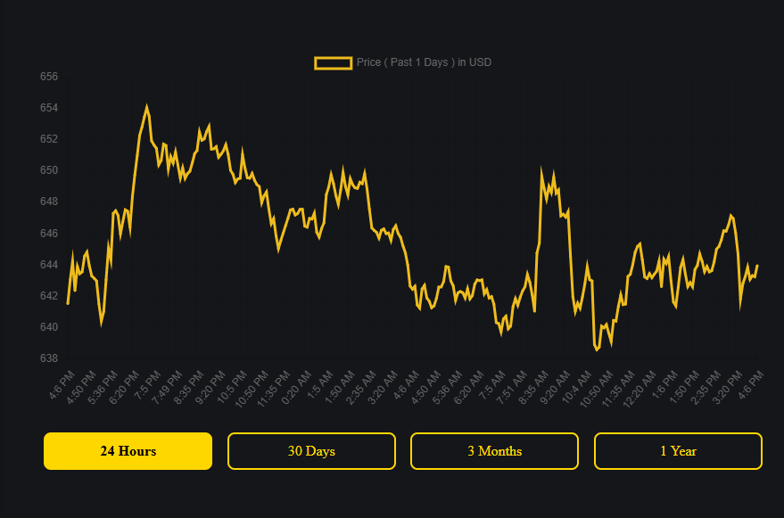

# Fullstack Developer Technical Assessment

## Assessment Overview

Technical assessment for senior fullstack developers. Replace the existing Chart.js implementation with TradingView Lightweight Charts and implement advanced interactive features.

---

## Objective

Migrate from Chart.js to TradingView Lightweight Charts and add interactive charting features that demonstrate senior-level expertise.

## Current Implementation

The existing chart uses Chart.js and looks like this:

*Current Chart.js implementation that needs to be replaced*

## Important Notes

**API Requirements:**
- The project uses CoinGecko API for cryptocurrency data
- Free API key recommended (optional for development)
- Understand free tier limitations: 10-50 calls/minute
- Design your solution within these rate limits
- Consider caching strategies to minimize API calls

**Getting Started:**
1. Review existing API implementation in `client/src/services/api.js`
2. Check current data format from `/api/crypto/chart/:id`
3. Understand CoinGecko API constraints before designing features
4. Plan your architecture around API limitations

---

## Requirements

### 1. Chart Library Integration

Replace Chart.js with TradingView Lightweight Charts and implement multiple chart visualization types.

### 2. Interactive Features

Add interactive capabilities including tooltips, zoom, pan, and technical indicators.

### 3. Performance and Optimization

Ensure smooth performance with efficient data handling and proper state management using custom hooks.

---

## Deliverables

- Updated chart implementation
- Custom hooks
- Brief documentation (300-500 words)
- Screenshots and demo video

---

## Evaluation

**Architecture and Code Quality — 40%**
- Clear structure and organization of components and hooks
- Code readability, maintainability, and appropriate React patterns

**Feature Implementation and Correctness — 30%**
- Required chart features function correctly and reliably
- No critical bugs or broken interactions under normal usage

**Performance and Data Handling — 20%**
- Efficient data usage and chart updates
- No obvious performance issues during interaction

**Error Handling and Resilience — 10%**
- Reasonable handling of API or data errors
- Application remains stable in failure scenarios

---

## Submission

Create branch `feature/tradingview-chart` and submit a pull request with implementation summary, screenshots, and documentation.

---

## Resources

- [TradingView Lightweight Charts](https://tradingview.github.io/lightweight-charts/)

---

## Final Notes

This assessment is designed to evaluate real-world development skills. We are looking for:

- Quality over quantity: Well-implemented core features are better than rushed complete features
- Problem-solving ability: How you approach challenges and make decisions
- Code craftsmanship: Clean, maintainable, and well-documented code
- Professional communication: Clear documentation and commit messages
- Attention to detail: Polish, error handling, and edge cases

---

**Last Updated:** February 2026  
**Maintained by:** PumaPulse Developer Team
